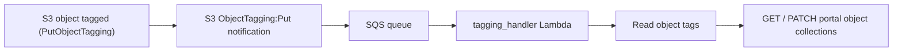

# s3-sqs-lambda

Trigger Lambdas from S3 notification events.

## What this service does

This service keeps the `collections` property of IGVF Data Portal objects in sync
with the collections recorded on the corresponding files in S3.

When a data file in the tracked S3 bucket is tagged (an S3 `ObjectTagging:Put`
event), the tags describe which portal object(s) the file belongs to and which
collections it should be part of. The service reads those tags and, for each
referenced portal accession, adds any missing collections to the portal object
via the portal API.

This lets the collection membership of a portal object be driven by the tags on
the S3 objects produced during catalog data loading, instead of being patched by
hand.

### Flow



1. An S3 object is tagged. S3 emits an `ObjectTagging:Put` notification to an SQS
   queue.
2. The `tagging_handler` Lambda polls the queue (in batches) and, for each event,
   fetches the object's current tag set with `GetObjectTagging`.
3. It reads the `portal_accessions` and `collections` tags (both space-separated
   lists). If either is missing or empty, the message is acknowledged and skipped
   -- not every tagging event is relevant to us.
4. For each accession, it `GET`s the portal object, computes which tagged
   collections are missing, and `PATCH`es the object's `collections` property only
   if there is something to add.
5. Failures are reported per-message via SQS partial batch responses, so
   successfully processed messages are removed from the queue and only failed
   messages are retried (and eventually sent to the dead-letter queue).

### S3 object tags

The service is driven entirely by tags on the S3 object. Two tags are used:

| Tag key             | Description                                                        | Example value                                  |
| ------------------- | ------------------------------------------------------------------ | ---------------------------------------------- |
| `portal_accessions` | Space-separated portal accession(s) the file belongs to.           | `IGVFDS3222WCZH IGVFDS7303VUTX`                |
| `collections`       | Space-separated collection name(s) the object should be part of.   | `IGVF_catalog_beta_v0.3 IGVF_catalog_v1.0`     |

The `collections` values must match the `collections` enum on the portal object's
schema (see, for example, the [`analysis_set` profile](https://api.data.igvf.org/profiles/analysis_set/)).
Note that "collection" is overloaded in the catalog: here it refers to the portal
`collections` property, which denotes a curated collection or catalog data
freeze/version (e.g. `IGVF_catalog_beta_v0.3`, `IGVF_catalog_v1.0`) -- not an
ArangoDB collection/table.

For example, an object tagged with:

```
portal_accessions = "IGVFDS3222WCZH IGVFDS7303VUTX"
collections        = "IGVF_catalog_beta_v0.3 IGVF_catalog_v1.0"
```

will cause the service to ensure that both `IGVFDS3222WCZH` and `IGVFDS7303VUTX`
on the portal include `IGVF_catalog_beta_v0.3` and `IGVF_catalog_v1.0` in their
`collections` property. If a portal object already contains all of the tagged
collections, it is left untouched.

Because `PutObjectTagging` replaces the entire tag set, an update that removes the
`collections` tag (or does not include `portal_accessions`) simply results in the
event being skipped.

## Configuration

Deployment values live in [`s3_sqs_lambda/config.py`](s3_sqs_lambda/config.py):

- `bucket_name` -- the existing S3 bucket whose tagging events are watched.
- `portal_api_url` -- base URL of the IGVF Data Portal API.
- `portal_secret_arn` -- Secrets Manager secret holding `BACKEND_KEY` and
  `BACKEND_SECRET_KEY`, used to authenticate to the portal.

## Deploy

```bash
npx aws-cdk@2.1126.0 deploy --profile profile
```
